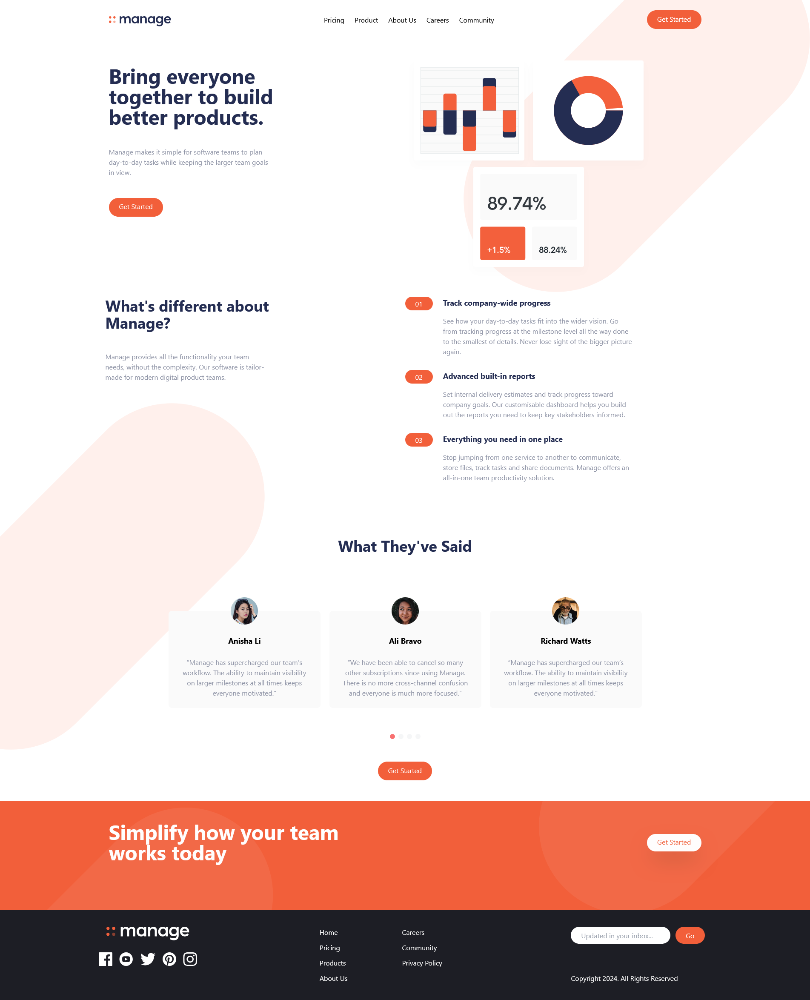

# Manage Landing Page

This is a simple and responsive landing page created using **HTML**, **Tailwind CSS**, and **JavaScript**. It is designed to showcase a clean and modern interface suitable for various applications such as product launches, services, or personal portfolios.

## Live Preview

You can view a live demo of the landing page by clicking the link below:

[Live Preview](https://famous-beignet-d56b2f.netlify.app)

## Features

- **Responsive Design**: The landing page is fully responsive and looks great on all devices (desktops, tablets, and mobiles).
- **Tailwind CSS**: Utilizes Tailwind CSS for styling, providing flexibility and a utility-first approach to design.
- **Interactive JavaScript**: Includes JavaScript for interactivity (e.g., form validation, dynamic elements).

## Tech Stack

- **HTML**: Markup language used to structure the content of the landing page.
- **Tailwind CSS**: Utility-first CSS framework used for styling and layout.
- **JavaScript**: Provides interactivity and dynamic features.

## Screenshots

Here is the screenshot of the landing page:

### Desktop View

